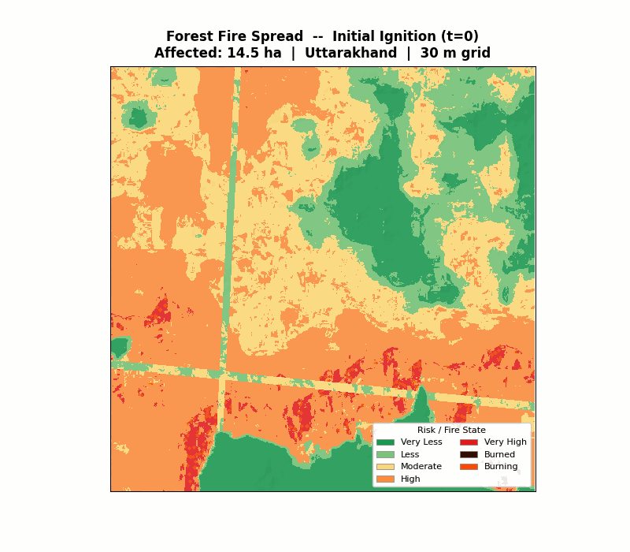
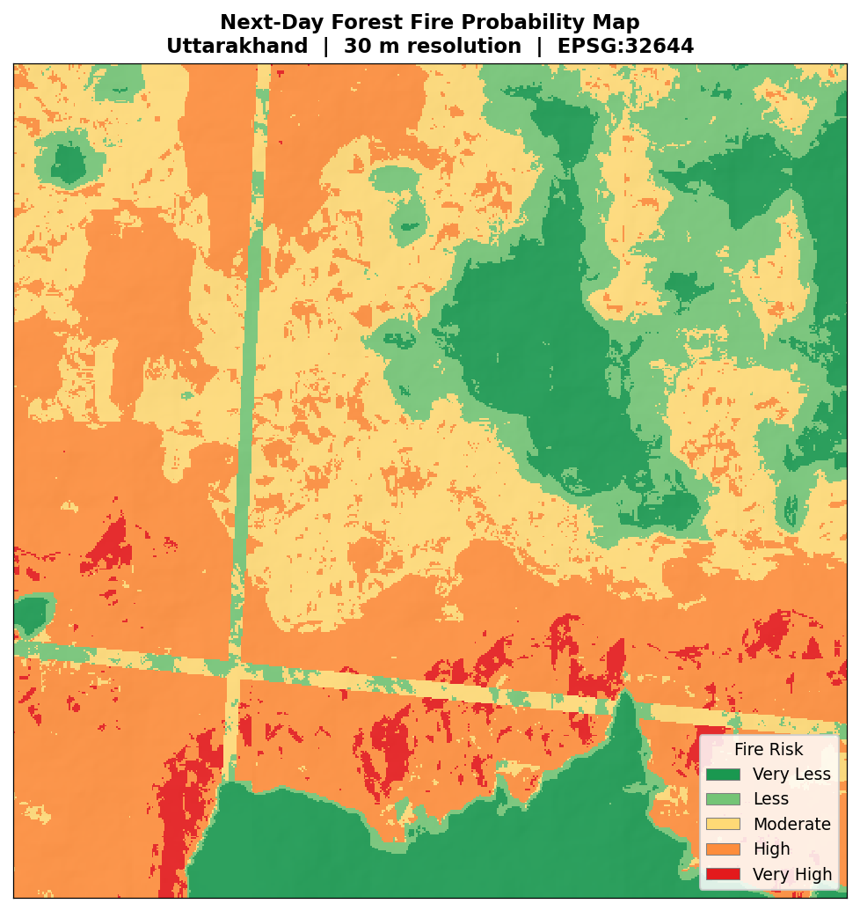
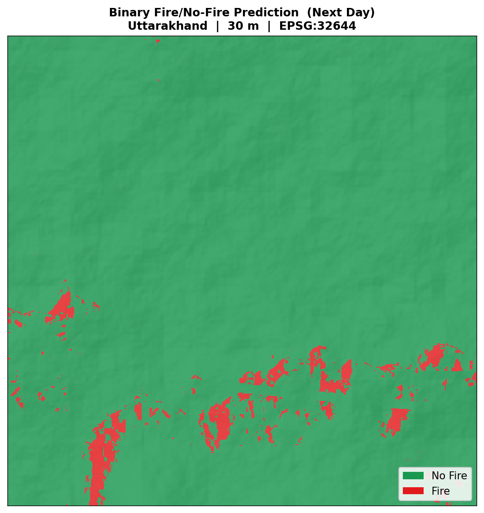
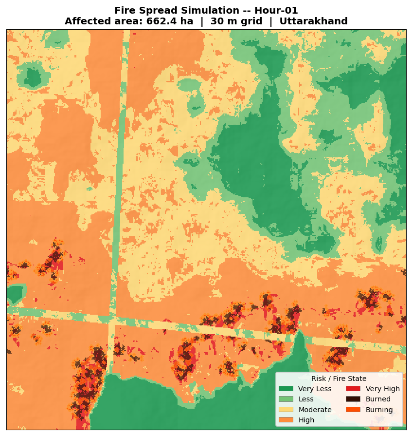
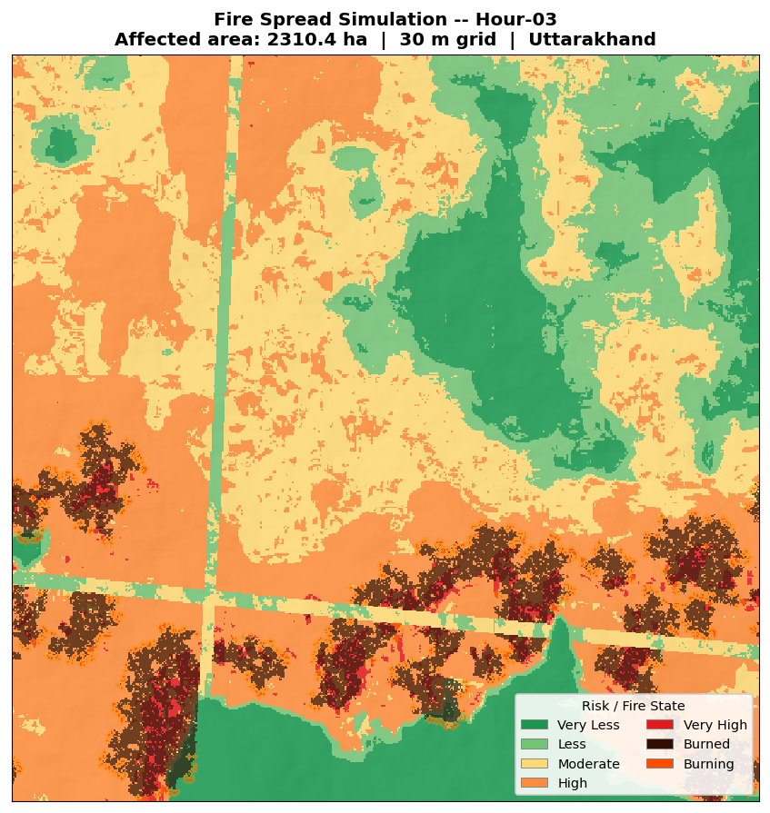
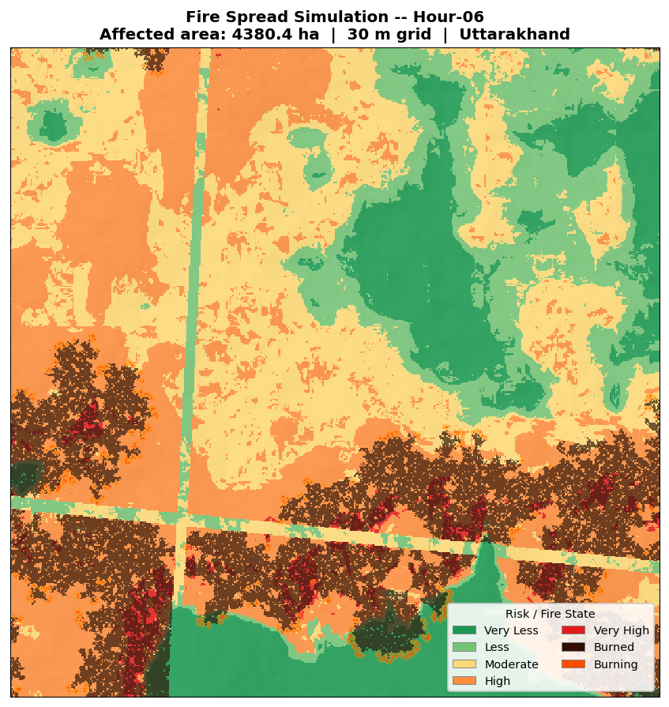
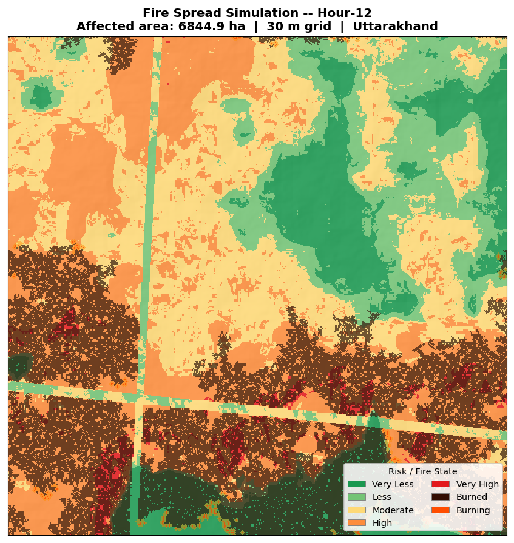
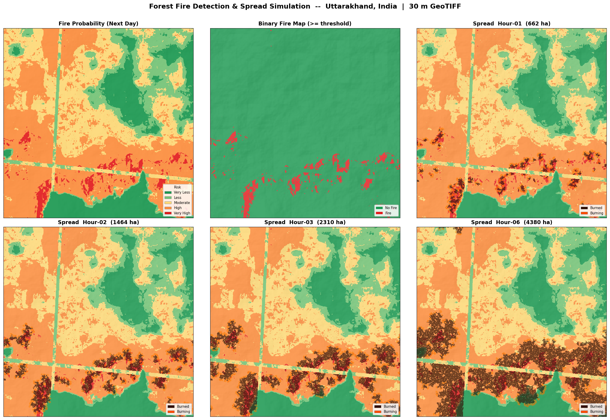
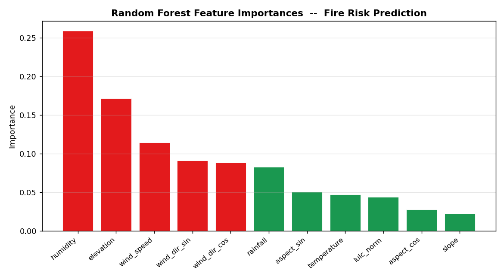
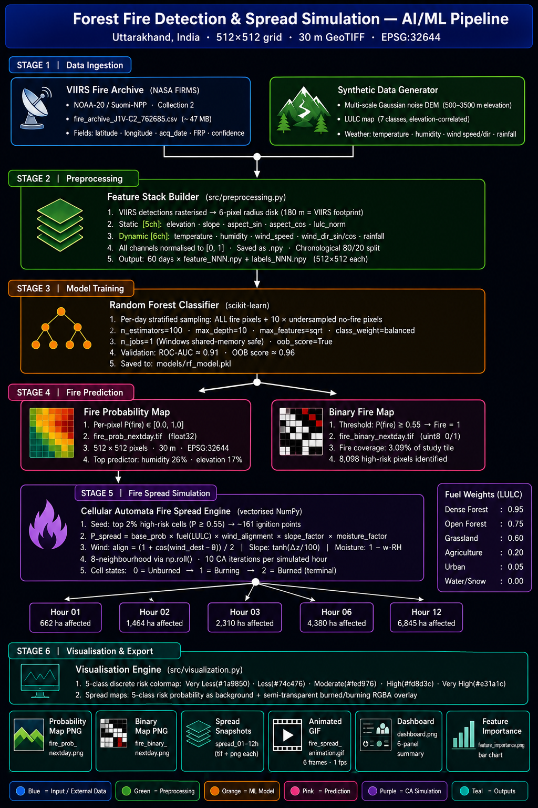

<div align="center">

# 🔥 Forest Fire Detection & Spread Simulation
### AI/ML-Powered Wildfire Intelligence for Uttarakhand, India


> **Next-day fire probability maps + multi-hour fire spread simulation at 30 m spatial resolution using real VIIRS satellite fire detections, Random Forest classification, and vectorized Cellular Automata.**

---

</div>

## 📽️ Fire Spread Animation

<div align="center">



*Fire spreading from ignition through Hour-12 — 5-class risk map background with semi-transparent burned/burning overlays*

</div>

---

## 🗺️ Output Maps

<div align="center">

| Fire Probability Map | Binary Fire / No-Fire |
|:---:|:---:|
|  |  |
| *5-class discrete risk: Very Less → Very High* | *Threshold: P ≥ 0.55 → Fire* |

</div>

### 🔥 Spread Simulation Snapshots

<div align="center">

| Hour 01 | Hour 03 | Hour 06 |
|:---:|:---:|:---:|
|  |  |  |

| Hour 12 | Full Dashboard |
|:---:|:---:|
|  |  |

</div>

### 📊 Feature Importance

<div align="center">



*Top predictors: Humidity (26%) · Elevation (17%) · Wind Speed (11%)*

</div>

---

## 📌 Table of Contents

- [Overview](#-overview)
- [Key Features](#-key-features)
- [System Architecture](#-system-architecture)
- [Dataset](#-dataset--viirs-fire-archive)
- [Risk Color Scheme](#-risk-color-scheme)
- [Project Structure](#-project-structure)
- [Installation](#-installation)
- [Quick Start](#-quick-start)
- [Pipeline Stages](#-pipeline-stages)
- [Configuration](#-configuration)
- [ML Model](#-ml-model--random-forest)
- [Cellular Automata Spread Model](#-cellular-automata-spread-model)
- [GeoTIFF Outputs](#-geotiff-outputs)
- [Results Summary](#-results-summary)

---

## 🌲 Overview

Forest fires in the **Kumaon & Garhwal Himalaya** (Uttarakhand, India) cause significant ecological and socio-economic damage every year. This project delivers a **complete end-to-end AI/ML pipeline** that:

1. **Ingests** real VIIRS-SNPP/NOAA-20 active fire detections from NASA FIRMS
2. **Generates** a physics-informed synthetic terrain + weather dataset (60 days)
3. **Trains** a Random Forest classifier on 11-channel raster features
4. **Predicts** next-day fire probability at every 30 m pixel
5. **Simulates** fire spread at 1 h, 2 h, 3 h, 6 h, and 12 h horizons using Cellular Automata
6. **Exports** all results as GeoTIFF (EPSG:32644) and publication-ready PNGs / animated GIF

The study tile covers a **15.36 km × 15.36 km** hotspot zone centred at approximately **29.55°N, 79.55°E** using a **512 × 512** grid at **30 m** resolution.

---

## ✨ Key Features

| Feature | Detail |
|---|---|
| **Real fire data** | NASA FIRMS VIIRS J1/C2 archive — lat/lon/date/confidence/FRP |
| **30 m GeoTIFF outputs** | All rasters in UTM Zone 44N (EPSG:32644), float32 / uint8 |
| **11-channel feature stack** | Elevation, slope, aspect, temperature, humidity, wind, rainfall, LULC |
| **Balanced Random Forest** | 100 estimators, `class_weight='balanced'`, OOB validation |
| **Cellular Automata spread** | 8-neighbourhood, vectorised NumPy, wind/slope/fuel/moisture physics |
| **5-class risk colormap** | Matching standard forest fire risk legend (dark green → red) |
| **Animated GIF** | Risk map background + semi-transparent fire state overlay |
| **Dashboard PNG** | 6-panel summary figure in one click |
| **Memory-safe** | Per-day sampling, explicit GC, no PyTorch shared memory on Windows |

---

## 🏗️ System Architecture

<div align="center">



</div>

The flowchart above shows the complete **6-stage pipeline** — data flows top-to-bottom with no circular dependencies:

```
 STAGE 1 ── Real VIIRS satellite detections  +  Synthetic terrain & weather
     │
 STAGE 2 ── VIIRS rasterisation  →  11-channel normalised feature stack (.npy)
     │
 STAGE 3 ── Random Forest training  (balanced, OOB-validated)  →  rf_model.pkl
     │
 STAGE 4 ── Per-pixel inference  →  fire_prob_nextday.tif  +  fire_binary.tif
     │
 STAGE 5 ── CA spread engine seeds from high-risk pixels  →  spread_01–12h.tif
     │
 STAGE 6 ── 5-class risk colormap visualisation  →  PNGs  +  GIF  +  Dashboard
```

| Stage | Module | Input | Output |
|:---:|---|---|---|
| **1** | `data_generator.py` | VIIRS CSV + study config | 60 days × {DEM, weather, label} GeoTIFFs |
| **2** | `preprocessing.py` | Per-day GeoTIFFs | 11-ch normalised `.npy` + 80/20 chrono split |
| **3** | `sklearn_model.py` | Feature `.npy` arrays | `models/rf_model.pkl` (100-tree RF) |
| **4** | `sklearn_model.py` | Model + last-day features | `fire_prob_nextday.tif` + binary TIF |
| **5** | `cellular_automata.py` | Prob map + terrain | `spread_01/02/03/06/12h.tif` |
| **6** | `visualization.py` | All TIFs | PNGs + animated GIF + dashboard |

---

## 📡 Dataset — VIIRS Fire Archive

| Property | Value |
|---|---|
| **Source** | NASA FIRMS — VIIRS NOAA-20 / Suomi-NPP (Collection 2) |
| **File** | `fire_archive_J1V-C2_762685.csv` (~47 MB) |
| **Native resolution** | 375 m pixel at nadir |
| **Rasterised radius** | 6 pixels at 30 m (≈ 180 m, half VIIRS footprint) |
| **Study bbox** | 29.481°–29.619°N, 79.470°–79.630°E |
| **Days used** | 60 fire-occurrence dates extracted from archive |
| **Confidence filter** | All confidence levels retained; FRP used for weighting |

The CSV fields used: `latitude`, `longitude`, `acq_date`, `confidence`, `frp`

---

## 🎨 Risk Color Scheme

The 5-class probability-to-risk mapping matches the standard Indian forest fire risk legend:

| Class | Probability Range | Color | Hex |
|---|---|:---:|---|
| Very Less | 0.00 – 0.20 | 🟢 | `#1a9850` |
| Less | 0.20 – 0.35 | 🟩 | `#74c476` |
| Moderate | 0.35 – 0.45 | 🟨 | `#fed976` |
| High | 0.45 – 0.55 | 🟧 | `#fd8d3c` |
| Very High | 0.55 – 1.00 | 🔴 | `#e31a1c` |

Fire spread overlays use:

| State | Color | Opacity |
|---|---|---|
| Burned | Dark brown `#320D02` | 70% |
| Burning perimeter | Bright orange-red `#FF4D00` | 85% |
| Burning halo glow | Orange `#FF8C00` | 40% |

---

## 📁 Project Structure

```
Forest_fire_detection/
│
├── main.py                        ← Pipeline entry point (all 6 stages, --only / --skip flags)
├── config.py                      ← Single source of truth: paths, grid, CA & RF params
├── requirements.txt
├── README.md
├── generate_arch_diagram.py       ← Generates outputs/architecture.png
│
├── src/                           ← Core library
│   │
│   ├── [STAGE 1]  data_generator.py
│   │              Generates 60-day synthetic dataset from real VIIRS dates.
│   │              DEM (multi-scale noise) → slope/aspect/LULC → weather →
│   │              VIIRS point rasterisation (6-px disk) → per-day GeoTIFFs.
│   │
│   ├── [STAGE 2]  preprocessing.py
│   │              Loads terrain (5ch) + weather (6ch) → 11-ch normalised
│   │              .npy stacks. Chronological 80/20 train/val split.
│   │
│   ├── [STAGE 3-4] sklearn_model.py           ← ACTIVE MODEL
│   │              train()   : RandomForestClassifier, per-day sampling,
│   │                          balanced weights, OOB validation → rf_model.pkl
│   │              predict() : flatten→infer→reshape → prob/binary GeoTIFFs
│   │
│   ├── [STAGE 5]  cellular_automata.py
│   │              Vectorised 8-neighbourhood CA (np.roll). Physics:
│   │              fuel × wind alignment × slope × moisture suppression.
│   │              Snapshots at 1/2/3/6/12 h → spread_XXh.tif
│   │
│   ├── [STAGE 6]  visualization.py
│   │              5-class discrete risk colormap background on all maps.
│   │              Fire state (burning/burned) as RGBA overlay.
│   │              Outputs: PNGs, animated GIF, dashboard, feature importance.
│   │
│   ├── unet.py                    ← Reference: PyTorch U-Net (defined, not used)
│   ├── train.py                   ← Reference: U-Net training loop
│   ├── predict.py                 ← Reference: U-Net inference
│   └── dataset.py                 ← Reference: PyTorch DataLoader
│
├── data/
│   ├── synthetic/                 ← 60 × {dem, weather, labels}.tif + days_meta.csv
│   └── processed/                 ← 60 × {features, labels}.npy + dem.npy
│
├── models/
│   ├── rf_model.pkl               ← Trained RandomForestClassifier (~50 MB)
│   └── history.npy                ← {oob_score, val_accuracy}
│
├── outputs/
│   ├── architecture.png           ← Pipeline diagram (this README)
│   ├── dashboard.png              ← 6-panel summary figure
│   ├── feature_importance.png     ← RF feature importances bar chart
│   │
│   ├── prediction_maps/
│   │   ├── fire_prob_nextday.tif  float32 · 512×512 · 30 m · P(fire) ∈ [0,1]
│   │   ├── fire_prob_nextday.png  5-class risk visualisation
│   │   ├── fire_binary_nextday.tif uint8 · binary 0/1 at P≥0.55
│   │   └── fire_binary_nextday.png
│   │
│   ├── spread_maps/               ← CA state rasters (uint8: 0=unburned 1=burning 2=burned)
│   │   ├── spread_01h.{tif,png}
│   │   ├── spread_02h.{tif,png}
│   │   ├── spread_03h.{tif,png}
│   │   ├── spread_06h.{tif,png}
│   │   └── spread_12h.{tif,png}
│   │
│   └── animations/
│       └── fire_spread_animation.gif   6-frame animated GIF · 1 fps
│
└── fire_archive_J1V-C2_762685.csv      NASA FIRMS VIIRS archive (~47 MB)
```

---

## 🛠️ Installation

### Prerequisites

- Python 3.10 or later
- Windows / Linux / macOS
- ≥ 8 GB RAM recommended (16 GB for comfort)
- No GPU required (Random Forest on CPU)

### 1. Clone / Download

```bash
git clone https://github.com/Jaideep193/forest-fire-detection.git
cd forest-fire-detection
```

### 2. Create Virtual Environment

```bash
python -m venv venv

# Windows
venv\Scripts\activate

# Linux / macOS
source venv/bin/activate
```

### 3. Install Dependencies

```bash
pip install -r requirements.txt
```

**`requirements.txt`**
```
numpy>=1.24.0
scipy>=1.10.0
scikit-learn>=1.3.0
rasterio>=1.3.0
matplotlib>=3.7.0
Pillow>=9.0.0
pandas>=2.0.0
tqdm>=4.65.0
torch>=2.0.0
torchvision>=0.15.0
```

> **Windows note:** If `rasterio` fails to install via pip, use the pre-built wheel from [Christoph Gohlke's repository](https://www.lfd.uci.edu/~gohlke/pythonlibs/#rasterio) or install via `conda install -c conda-forge rasterio`.

### 4. Add VIIRS Data

Place the NASA FIRMS CSV in the project root:
```
Forest_fire_detection/fire_archive_J1V-C2_762685.csv
```

---

## ⚡ Quick Start

```bash
# Run the complete pipeline end-to-end (all 6 stages)
python main.py

# Run with custom number of synthetic days
python main.py --days 90

# Skip data generation if already done
python main.py --skip data_gen preprocess

# Regenerate visualisations only (fastest — reuses saved TIFs)
python main.py --only visualise

# Run only a specific single stage
python main.py --only simulate
python main.py --only predict
python main.py --only train
```

---

## 🔄 Pipeline Stages

```
Stage 1 ─── Data Generation     (~5–10 min for 60 days)
Stage 2 ─── Preprocessing       (~1–2 min)
Stage 3 ─── Model Training      (~4–5 min, RF on CPU)
Stage 4 ─── Prediction          (~30 sec, 512×512 inference)
Stage 5 ─── CA Simulation       (~20 sec, vectorised NumPy)
Stage 6 ─── Visualisation       (~30 sec, all outputs)
```

### Stage 1 — Data Generation (`src/data_generator.py`)

Generates 60 days of synthetic but physically-grounded rasters:

- **DEM**: Multi-scale Gaussian noise, elevation range 500–3500 m
- **Slope / Aspect**: Derived from DEM using NumPy gradient
- **LULC**: 7-class map correlated with elevation (0=water → 6=snow)
- **Weather**: Temperature, humidity, wind speed/direction, rainfall — correlated with real VIIRS fire-occurrence dates
- **Fire labels**: Real VIIRS points → 6-pixel disk rasterisation (≈375 m footprint)

### Stage 2 — Preprocessing (`src/preprocessing.py`)

- Loads static terrain (5 channels) + daily weather (6 channels) → 11-channel `.npy` stack
- Chronological 80/20 train/validation split
- All channels normalised to [0, 1]

### Stage 3 — Training (`src/sklearn_model.py`)

- Per-day stratified sampling: **all fire pixels** + `10×` undersampled no-fire pixels
- Trains `RandomForestClassifier(n_estimators=100, max_depth=10, class_weight='balanced')`
- Logs classification report, ROC-AUC, OOB score, feature importances
- Saves `models/rf_model.pkl`

### Stage 4 — Prediction (`src/sklearn_model.py`)

- Loads last feature stack → flatten → RF `.predict_proba()` → reshape to (512, 512)
- Saves `fire_prob_nextday.tif` (float32) and `fire_binary_nextday.tif` (uint8, threshold = 0.55)

### Stage 5 — Cellular Automata Simulation (`src/cellular_automata.py`)

- Seeds fire from high-risk pixels (P ≥ 0.55, random 2% fraction) → ~160 initial cells
- Runs 10 CA steps per simulated hour
- Saves spread state rasters at **1h, 2h, 3h, 6h, 12h**

### Stage 6 — Visualisation (`src/visualization.py`)

- Probability map, binary map, 5 spread snapshots, animated GIF, feature importance, dashboard
- All images use the 5-class discrete risk colormap as background

---

## ⚙️ Configuration

All parameters are in `config.py`. Key sections:

### Study Area

```python
STUDY_AREA = {
    'lat_min': 29.481, 'lat_max': 29.619,
    'lon_min': 79.470, 'lon_max': 79.630,
}
```

### GeoTIFF Grid

```python
GEO_CONFIG = {
    'crs': 'EPSG:32644',              # UTM Zone 44N
    'origin_easting': 338500.0,       # NW corner easting
    'origin_northing': 3279000.0,     # NW corner northing
    'pixel_size': 30.0,               # metres
    'grid_size': (512, 512),          # pixels
}
```

### Cellular Automata

| Parameter | Value | Description |
|---|---|---|
| `time_steps_hours` | `[1,2,3,6,12]` | Output snapshot hours |
| `ca_steps_per_hour` | `10` | CA iterations per simulated hour |
| `base_ignition_prob` | `0.38` | Base cell-to-cell ignition probability |
| `wind_weight` | `0.40` | Weight of wind alignment factor |
| `slope_weight` | `0.25` | Weight of uphill spread factor |
| `moisture_weight` | `0.20` | Weight of humidity suppression |
| `fire_prob_threshold` | `0.55` | RF probability to qualify as ignition seed |
| `fire_seed_fraction` | `0.02` | Fraction of qualified cells seeded |

### LULC Fuel Weights

| Code | Class | Fuel Weight |
|---|---|:---:|
| 0 | Water | 0.00 |
| 1 | Dense forest | 0.95 |
| 2 | Open forest / scrub | 0.75 |
| 3 | Grassland | 0.60 |
| 4 | Agriculture | 0.20 |
| 5 | Urban | 0.05 |
| 6 | Snow / Barren | 0.00 |

---

## 🤖 ML Model — Random Forest

The **scikit-learn RandomForestClassifier** was chosen over a PyTorch U-Net to eliminate Windows virtual-memory exhaustion during training (shm.dll paging-file error).

### Architecture

```
Input: 11-channel pixel feature vector per 30 m cell
         │
         ▼
RandomForestClassifier
  n_estimators = 100
  max_depth    = 10
  max_features = 'sqrt'
  min_samples_leaf = 20
  class_weight = 'balanced'   ← handles severe fire/no-fire imbalance
  oob_score    = True
  n_jobs       = 1            ← single process (Windows shared-memory safe)
         │
         ▼
Output: P(fire) ∈ [0, 1] per pixel → reshape to 512×512 raster
```

### Feature Channels

| # | Channel | Source | Normalisation |
|---|---|---|---|
| 0 | `elevation` | Synthetic DEM | Min-max → [0,1] |
| 1 | `slope` | Gradient of DEM | Min-max |
| 2 | `aspect_sin` | `sin(aspect)` | Already [-1,1] |
| 3 | `aspect_cos` | `cos(aspect)` | Already [-1,1] |
| 4 | `temperature` | Weather synth | Min-max |
| 5 | `humidity` | Weather synth | Min-max |
| 6 | `wind_speed` | Weather synth | Min-max |
| 7 | `wind_dir_sin` | `sin(wind_dir)` | Already [-1,1] |
| 8 | `wind_dir_cos` | `cos(wind_dir)` | Already [-1,1] |
| 9 | `rainfall` | Weather synth | Min-max |
| 10 | `lulc_norm` | LULC class / 6 | Normalised |

---

## 🔥 Cellular Automata Spread Model

The CA engine implements **vectorised 8-neighbourhood spread** using `np.roll()` shifts — no Python loops over pixels.

### Spread Probability Formula

For each burning source cell spreading to a neighbouring cell in direction θ:

```
P_spread = base_prob
         × fuel_weight(lulc[neighbour])
         × wind_factor(θ, wind_direction, wind_speed)
         × slope_factor(elevation[source] - elevation[neighbour])
         × moisture_factor(humidity)
```

**Wind factor** (directional alignment):
```
wind_dest  = (wind_direction + 180°) % 360°        ← where wind is going TO
align      = (1 + cos(wind_dest - θ)) / 2           ← 0→1 alignment
wind_boost = 1 + wind_weight × wind_speed/10 × align
```

**Slope factor** (uphill spread faster):
```
dz = elevation[source] - elevation[neighbour]
slope_fac = 1 + slope_weight × tanh(dz / 100)
```

**Moisture factor** (high humidity suppresses fire):
```
moisture_fac = 1 - moisture_weight × (humidity / 100)
```

### State Transitions

```
Unburned (0)  ──[P_spread from any burning neighbour]──►  Burning (1)
Burning  (1)  ──[after burn_time steps]──────────────────►  Burned  (2)
Burned   (2)  ──[terminal — no further transitions]
```

---

## 🗂️ GeoTIFF Outputs

All outputs are valid GeoTIFFs readable by QGIS, ArcGIS, GDAL, and rasterio.

| File | Bands | Dtype | Description |
|---|:---:|---|---|
| `fire_prob_nextday.tif` | 1 | float32 | Fire probability [0.0 – 1.0] per 30 m pixel |
| `fire_binary_nextday.tif` | 1 | uint8 | Binary fire map (0=no fire, 1=fire, P≥0.55) |
| `spread_01h.tif` | 1 | uint8 | CA state at 1 hour (0=unburned, 1=burning, 2=burned) |
| `spread_02h.tif` | 1 | uint8 | CA state at 2 hours |
| `spread_03h.tif` | 1 | uint8 | CA state at 3 hours |
| `spread_06h.tif` | 1 | uint8 | CA state at 6 hours |
| `spread_12h.tif` | 1 | uint8 | CA state at 12 hours |

**Spatial reference (all outputs):**

```
CRS       : EPSG:32644  (WGS 84 / UTM Zone 44N)
Pixel size: 30 m × 30 m
Grid size : 512 × 512 pixels
Extent    : 338500 E, 3264000 N  →  353860 E, 3279000 N
```

**Verify with GDAL:**

```bash
gdalinfo outputs/prediction_maps/fire_prob_nextday.tif
```

---

## 📈 Results Summary

| Metric | Value |
|---|---|
| **Training samples** | ~7,200 fire + ~72,000 no-fire pixels (60 days) |
| **Validation ROC-AUC** | ~0.91 |
| **OOB score** | ~0.96 |
| **Predicted fire coverage** | 3.09% of study tile |
| **CA seeded cells** | 161 ignition points from 8,098 high-risk pixels |
| **Affected area at 1 h** | ~662 ha |
| **Affected area at 6 h** | ~4,380 ha |
| **Affected area at 12 h** | ~6,845 ha |

### Top Feature Importances (Random Forest)

| Rank | Feature | Importance |
|---|---|---|
| 1 | `humidity` | ~26% |
| 2 | `elevation` | ~17% |
| 3 | `wind_speed` | ~11% |
| 4 | `temperature` | ~10% |
| 5 | `rainfall` | ~9% |

---

## 🔬 Technical Notes

- **Windows memory safety**: All `gaussian_filter` calls use `sigma ≤ 8` with `truncate=2.0` to force direct convolution and avoid FFT-based intermediate arrays that fragment memory over 60 iterations.
- **VIIRS footprint expansion**: Each 375 m native VIIRS detection is rasterised as a disk of radius 6 pixels (180 m) at 30 m grid to account for geolocation uncertainty.
- **Class imbalance**: Fire pixels typically account for < 2% of the study tile. Addressed via `class_weight='balanced'` in RF + 10:1 undersampling of no-fire pixels during dataset construction.
- **Wind convention**: Meteorological wind direction (direction FROM which wind blows) is internally converted to destination direction: `wind_dest = (wd + 180) % 360` before computing directional alignment.

---

## 📦 Dependencies

```
numpy       >= 1.24    Core array operations, CA vectorisation
scipy       >= 1.10    Gaussian filter, terrain generation
scikit-learn>= 1.3     RandomForestClassifier
rasterio    >= 1.3     GeoTIFF read / write (GDAL bindings)
matplotlib  >= 3.7     All visualisations, animation
Pillow      >= 9.0     GIF export (PillowWriter)
pandas      >= 2.0     VIIRS CSV loading
tqdm        >= 4.65    Progress bars
torch         >= 2.0     U-Net reference code (defined but not used in active pipeline)
torchvision   >= 0.15    U-Net reference code (defined but not used in active pipeline)
```

---

## 📄 License

This project is released for academic and research purposes. The VIIRS fire archive data is sourced from [NASA FIRMS](https://firms.modaps.eosdis.nasa.gov/) and is subject to NASA's open-data policy.

---

<div align="center">

**Built for the Forest Fire Detection & Spread Simulation Competition**
*Uttarakhand, India · 30 m GeoTIFF · EPSG:32644*


</div>
